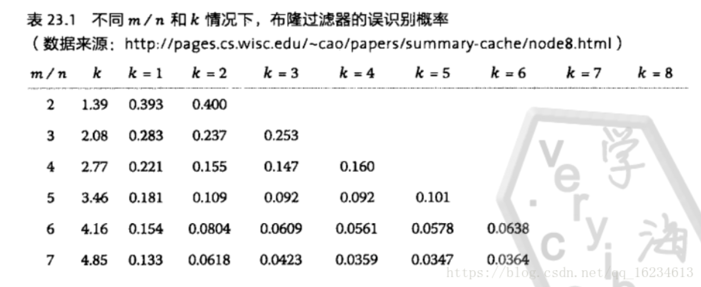

### Stable Storage
backend source code : src/exp/
## Container
backend source code : src/exp/Container.mo
Container是控制Bucket，进行自动生成新的Bucket， 充值Cycle等， 相当于Bucket的管家， 接下来Container应该做的是一个query的中转， 而不是上传数据等（TODO）
目前Container为了测试方便 参数是Text， 可以改成Blob， 然后使用dfx canister call cansiter_id function_name '(Blob "data")'

## Bucket

backend suorce code : src/exp/Bucket.mo
Bucket只负责存数据，增删改查，不负责其他的
TODO 1 : 下一步是考虑数组存和stable树存，这两个哪一个更好
TODO 2 : 测试Stable Map的stable特性
TODO 3 : 支持多种索引树
-

## BloomFilter Error Rate

number of hash function : k

size of bit array : m

elment number of bit array : n

*  best k = (m/n)*ln2 -> 0.7 * (m/n)

* 
